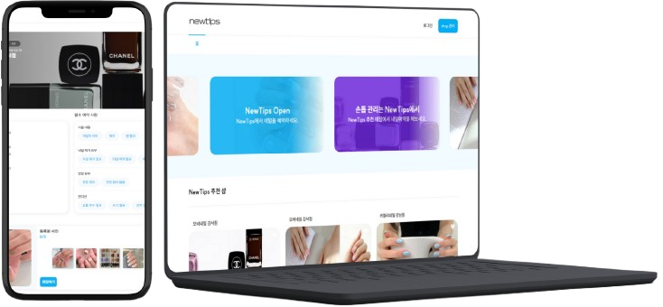

# 네일케어 예약 및 관리 플랫폼 - Nail Case

<br/>

<p align="center">
  <strong>"언제 어디서나 간편하게, 나만의 네일 아트를 예약하고 관리하세요."</strong>
</p>

<br/>

**Nail Case**는 네일샵 점주와 고객을 잇는 웹 기반 예약 및 관리 솔루션입니다. 고객은 지도 기반 검색, 다양한 네일 아트 탐색을 통해 원하는 샵을 손쉽게 예약할 수 있습니다. 점주는 복잡한 예약 관리, 고객 응대, 매장 홍보를 하나의 플랫폼에서 효율적으로 처리하며 비즈니스 성장에 집중할 수 있습니다.

<br/>

<p align="center">
  
</p>
<br/>

---

## ✨ 주요 기능 (User Features)

Nail Case는 **고객(Customer)** 과 **점주(Manager)**, 두 가지 사용자 역할을 위한 맞춤형 기능을 제공합니다.

#### 🙋‍♀️ 고객용 기능
- **간편 예약**: 원하는 날짜와 시간을 선택하여 실시간으로 예약을 신청하고 관리할 수 있습니다.
- **이달의 아트**: 매장에서 등록한 트렌디한 네일 아트를 모아보고, 예약 시 바로 선택할 수 있습니다.
- **실시간 채팅 및 알림**: 예약 관련 문의를 점주와 실시간으로 주고받고, 예약 상태 변경 시 즉시 알림을 받습니다.

#### 👨‍💼 점주용 기능
- **매장 등록 및 관리**: 매장 기본 정보, 위치, 운영 시간 등을 손쉽게 등록하고 수정할 수 있습니다.
- **예약 관리 대시보드**: 캘린더 뷰를 통해 월별/일별 예약 현황을 한눈에 파악하고, 예약을 확정하거나 거절할 수 있습니다.
- **네일 아트 관리**: 매장에서 시술하는 다양한 네일 아트를 등록하고, 가격 및 정보를 관리하여 고객에게 노출합니다.
- **고객 관리**: 실시간 채팅을 통해 고객 문의에 응대하고, 예약 고객 정보를 관리합니다.

---

## 🎬 서비스 핵심 플로우 데모 (Demo Videos)

이력서 검토자 분들이 실제 서비스처럼 경험하실 수 있도록, 고객과 점주의 핵심적인 사용 흐름을 영상으로 준비했습니다.

### 1. 고객 예약 플로우 (Customer Reservation Flow)

고객이 앱을 통해 네일샵을 탐색하고, 원하는 아트와 시간을 선택하여 예약을 완료하기까지의 전체적인 과정을 보여줍니다. 이 영상을 통해 고객 관점에서의 직관적인 UI와 편리한 예약 경험을 확인하실 수 있습니다.

> **[📹 데모 영상] 고객의 매장 탐색부터 예약까지 전 과정**
> 
> 

<br>


### 2. 점주 예약 관리 플로우 (Manager's Reservation Management Flow)

점주가 예약 관리 대시보드에서 신규 예약 내역을 확인하고, 캘린더의 다른 일정과 비교하여 예약을 **확정** 또는 **거절**하는 과정을 보여줍니다. 점주의 결정에 따라 고객의 예약 상태 또한 실시간으로 업데이트됩니다.

> **[📹 데모 영상] 예약 대시보드에서의 예약 확정 및 거절 처리**
> 
> 

---

## 🚀 핵심 기술 역량 (Core Technical Competencies)

위 데모에서 보여드린 사용자 경험은 아래와 같은 기술 역량을 바탕으로 구현되었습니다.

1.  **Tanstack Query를 활용한 효율적인 서버 상태 관리**
    - **`Tanstack Query (React Query)`** 를 도입하여 서버 데이터의 `Fetching`, `Caching`, `Synchronization`을 자동화했습니다. 이를 통해 불필요한 API 호출을 최소화하고, 사용자에게 항상 최신 데이터를 제공하며, 낙관적 업데이트(Optimistic Updates)를 통해 뛰어난 사용자 경험을 구현합니다.

2.  **실시간 통신을 위한 Server-Sent Events (SSE) 활용**
    - **Server-Sent Events (SSE)** 를 이용하여 서버로부터 클라이언트로 단방향 실시간 데이터 스트리밍을 구현했습니다. 고객이 예약을 요청하거나 점주가 예약을 확정/거절할 때, 관련 사용자에게 즉시 토스트 알림이 전송되어 중요한 변경사항을 놓치지 않도록 합니다.

3.  **Context API와 Custom Hook을 이용한 전역 상태 관리 (모달, 토스트)**
    - `React Context API`와 `Custom Hook`을 결합하여 프로젝트 전역에서 사용되는 모달(Modal) 및 토스트(Toast) UI의 상태를 효율적으로 관리합니다. 이를 통해 어떤 컴포넌트에서든 `useModal()`, `useToast()` 훅을 호출하는 것만으로 손쉽게 UI를 제어하여 코드의 응집도를 높이고 `props drilling`을 방지합니다.

4.  **Next.js Middleware를 활용한 인증 및 권한 관리**
    - `Next.js Middleware`를 활용하여 특정 경로에 대한 사용자 인증 및 역할(고객/점주) 기반 권한을 효과적으로 제어합니다. 비인가 사용자의 페이지 접근을 막고, 적절한 페이지로 리다이렉트시켜 보안성과 사용자 경험을 동시에 향상시킵니다.

---

## 🛠️ 기술 스택 (Tech Stack)

- **Core**: `Next.js`, `React`, `TypeScript`
- **Styling**: `TailwindCSS`, `shadcn/ui`, `PostCSS`
- **State Management**: `Tanstack Query (React Query)`, `Context API`
- **Component Development**: `Storybook`
- **API Communication**: `Axios`
- **Linting & Formatting**: `ESLint`, `Prettier`

---

## 📂 폴더 구조 (Folder Structure)

```
D:\Front\Front_End\nail-case-client
├── .storybook/      # Storybook 설정
├── public/          # 정적 에셋 (이미지, 폰트)
├── src/
│   ├── app/         # Next.js App Router 기반 라우팅
│   │   ├── (customer)/  # 고객용 페이지 그룹
│   │   ├── (manager)/   # 점주용 페이지 그룹
│   │   └── sign/        # 로그인, 회원가입 관련 페이지
│   ├── component/   # 재사용 가능한 UI 컴포넌트
│   │   ├── common/      # 공통 컴포넌트 (Atomic Design 기반)
│   │   └── custom/      # 특정 페이지/도메인에 종속된 컴포넌트
│   ├── config/      # 설정 관련 파일 (Axios, Tanstack Query 등)
│   ├── constant/    # 전역 상수
│   ├── hook/        # 비즈니스 로직 및 UI 로직을 담는 Custom Hooks
│   ├── type/        # 전역 TypeScript 타입 및 인터페이스
│   └── util/        # 유틸리티 함수
│       ├── api/         # API 호출 함수 집합
│       └── common/      # 공통 헬퍼 함수
├── ...
```


---

## 🤝 협업 및 개발 문화 (Collaboration & Development Culture)

본 프로젝트는 체계적인 프로세스와 명확한 컨벤션을 바탕으로 효율적인 협업을 지향합니다.

### 📝 **문서화 및 작업 관리**
- **Notion**: API 명세서, 회의록, 기능 요구사항 등 모든 프로젝트 문서를 중앙에서 관리하고 공유합니다.
- **Jira**: 요구사항을 기능 단위의 티켓으로 분해하고, 2주 단위의 스프린트를 운영하여 작업을 체계적으로 추적하고 관리합니다.

### 💻 **코드 컨벤션**
- **ESLint**: `.eslintrc.json`에 정의된 규칙을 통해 코드의 일관성과 잠재적 오류를 방지합니다.
- **Prettier**: `.prettierrc` 설정을 기반으로 코드 제출(commit) 시 자동으로 코드 스타일을 통일하여 가독성을 높입니다.

### 💬 **커밋 컨벤션**
- **Conventional Commits** 명세를 따라 커밋 메시지를 작성하여, 커밋 내역만으로도 변경 사항을 쉽게 파악할 수 있도록 합니다.
- `type(scope): subject` 형식으로 작성합니다.
  - `feat`: 새로운 기능 추가
  - `fix`: 버그 수정
  - `refactor`: 코드 리팩토링
  - `style`: 코드 스타일 수정 (포매팅 등)
  - `docs`: 문서 수정
  - `test`: 테스트 코드 관련 변경
  - `chore`: 빌드 및 기타 설정 변경

### 🌿 **브랜치 전략**
- **Git-flow** 전략을 사용하여 코드베이스를 안정적으로 관리합니다.
  - `main`: 배포 가능한 프로덕션 브랜치
  - `develop`: 다음 릴리즈를 준비하는 개발 브랜치
  - `feature/{issue-number}-{feature-name}`: 기능 개발 브랜치
  - `hotfix/{issue-name}`: 긴급 버그 수정 브랜치
- 모든 변경 사항은 `develop` 브랜치를 타겟으로 **Pull Request(PR)**를 생성하며, **코드 리뷰**를 통과해야만 병합(Merge)할 수 있습니다.

---

## 🙌 기여자 (Contributors)

| 이름 (Name) | 깃허브 (GitHub) | 역할 (Role) |
| :---: | :---: | :---: |
| Jeff | [@TransparentDeveloper](https://github.com/TransparentDeveloper) | Frontend |
| Chan | [@snkchan](https://github.com/snkchan) | Frontend |
| Levi | [@HeesikK](https://github.com/HeesikK) | Frontend |
| Riel | [@keeprok](https://github.com/keeprok) | Frontend |

---
